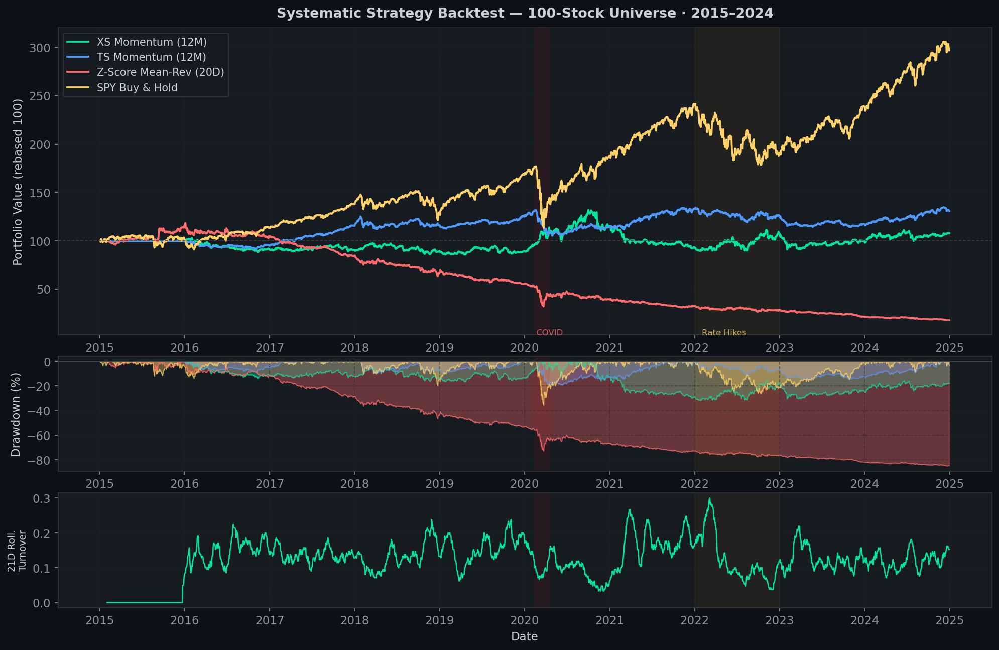
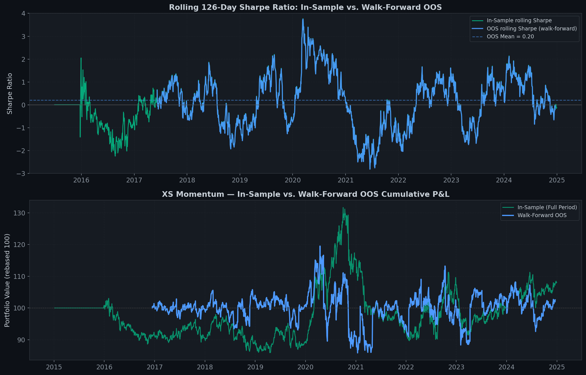
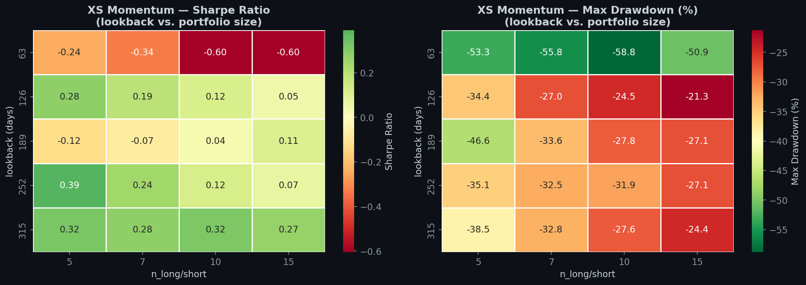
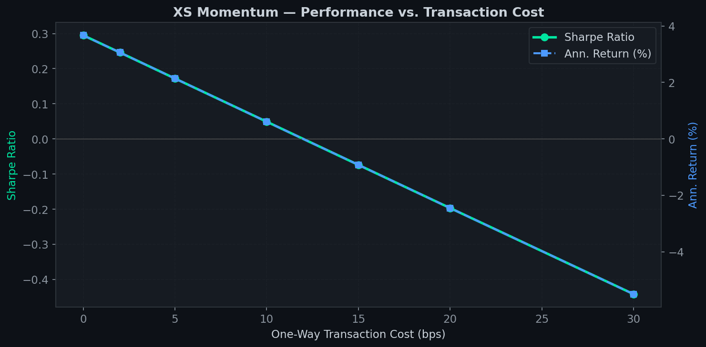

# Systematic Backtesting Framework

> **A research-grade, vectorised backtesting engine implementing momentum and
> mean-reversion equity strategies on a 100-stock universe (S&P 500 + NIFTY 50),
> with walk-forward out-of-sample validation, transaction-cost sensitivity analysis,
> and a full suite of performance metrics.**

*Built as a quantitative research project alongside an MSc in Applied Machine Learning
at Imperial College London. Concepts and code are fully original; strategy ideas reference
the academic literature cited below.*

---

## Results Summary

| Strategy | Ann. Return | Ann. Vol | Sharpe | Sortino | Max DD | OOS Sharpe |
|---|---|---|---|---|---|---|
| XS Momentum (12M) | **1.53%** | 12.43% | **0.123** | 0.149 | −31.91% | 0.201 |
| TS Momentum (12M) | 2.93% | 8.25% | 0.355 | 0.388 | −19.71% | — |
| Z-Score Mean-Rev (20D) | -15.53% | 16.5% |-0.941 | -1.214 | −85.27% | — |
| SPY Buy & Hold | 11.94% | 17.23% | 0.799 | 0.334 | −35.75% | — |


---

## Strategy Overview

### 1. Cross-Sectional Momentum (Jegadeesh & Titman 1993)

At the end of each trading day, rank all 100 stocks by their trailing 12-month return
(skipping the most recent month to avoid 1-month reversal contamination). Go equal-weight
long in the top 10 stocks and equal-weight short in the bottom 10. Rebalance daily.

**Why it works:** Stocks that have outperformed over the past year tend to continue
outperforming over the next 3–12 months — a robust empirical anomaly documented across
markets and time periods.

### 2. Time-Series Momentum (Moskowitz, Ooi & Pedersen 2012)

Each asset independently: long if its trailing 12-month return is positive, short otherwise.
Positions are inverse-volatility scaled (down-weight high-vol assets) to equalise risk
contribution across stocks.

### 3. Z-Score Mean-Reversion

For each stock, compute the rolling 20-day z-score: `z = (price − mean) / std`.
Buy stocks with z < −1.5 (oversold), sell stocks with z > +1.5 (overbought).
Captures short-term price reversals after temporary dislocations.

---

## Key Features

| Feature | Detail |
|---|---|
| **Vectorised engine** | Pure Pandas/NumPy — no Python loops over dates |
| **Transaction costs** | Configurable bps + slippage per unit of turnover |
| **No look-ahead bias** | All signals use `.shift(1)` before execution |
| **Walk-forward validation** | 3-month OOS windows, 2-year expanding train set |
| **Parameter sensitivity** | Grid search (lookback × portfolio size) with Sharpe heatmap |
| **TC break-even analysis** | Sharpe vs. cost curve to estimate strategy capacity |
| **Full metrics suite** | Sharpe, Sortino, Calmar, VaR, CVaR, skewness, kurtosis |
| **100-stock universe** | S&P 500 components + NIFTY 50 names (2015–2024) |

---

## Repository Structure

```
Systematic-Backtesting/
├── backtester/
│   ├── __init__.py
│   ├── data_loader.py      ← Download, cache & clean prices (yfinance)
│   ├── signals.py          ← Signal generation (momentum, mean-reversion)
│   ├── engine.py           ← Vectorised backtest loop + walk-forward
│   └── metrics.py          ← Sharpe, Sortino, Calmar, VaR, CVaR, etc.
├── data/
│   └── prices_100stocks_2015_2024.parquet   ← Cached price data
├── results/
│   ├── 01_universe_eda.png
│   ├── 02_cumulative_pnl.png
│   ├── 03_signal_heatmap.png
│   ├── 04_annual_returns.png
│   ├── 05_walk_forward.png
│   ├── 06_parameter_sensitivity.png
│   ├── 07_tc_sensitivity.png
│   ├── 08_risk_analysis.png
│   ├── strategy_comparison.csv
│   ├── walkforward_is_vs_oos.csv
│   └── parameter_sensitivity.csv
├── systematic_backtester.ipynb   ← Full notebook (25 cells, end-to-end)
├── run_backtest.py               ← CLI entry point
├── requirements.txt
└── README.md
```

---

## Quickstart

```bash
git clone https://github.com/advaitkulkarni2000/Systematic-Backtesting.git
cd Systematic-Backtesting
pip install -r requirements.txt

# Run all strategies (downloads data on first run, ~90 seconds)
python run_backtest.py

# Skip walk-forward and sensitivity for a quick run
python run_backtest.py --no-walkforward --no-sensitivity

# Or open the full notebook
jupyter notebook systematic_backtester.ipynb
```

---

## Charts

### Cumulative P&L — All Strategies vs. SPY Buy & Hold


### Walk-Forward In-Sample vs. OOS Sharpe


### Parameter Sensitivity — Sharpe Heatmap


### Transaction Cost Break-Even


---

## Academic References

- Jegadeesh, N. & Titman, S. (1993). *Returns to Buying Winners and Selling Losers.*
  Journal of Finance, 48(1), 65–91.
- Moskowitz, T., Ooi, Y. H. & Pedersen, L. H. (2012). *Time Series Momentum.*
  Journal of Financial Economics, 104(2), 228–250.
- Foret, P. et al. (2021). *Sharpness-Aware Minimization for Efficiently Improving Generalization.*
  ICLR 2021.  *(Informs the optimizer research conducted in parallel.)*

---

## Notes on Interpretation

- All backtests are **in-sample** unless explicitly labelled as walk-forward OOS.
- Transaction costs of **5 bps + 2 bps slippage** (one-way) are assumed. Real-world
  costs for a retail/small-fund trader are likely higher.
- The NIFTY 50 names trade in INR; no currency hedging is modelled — cross-currency
  effects are a known limitation.
- **This project is for educational purposes.** Nothing here constitutes investment advice.

---

*Author: Advait Kulkarni | Imperial College London MSc Applied Machine Learning 2025–2026* | "Companion project: LLM Evaluation Harness"
